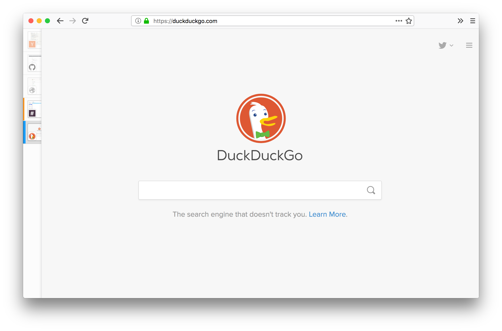

Expeditor
=========

*Expeditor* is a collection of [userChrome.css](https://www.userchrome.org/) that provides a compact, information-dense, and aesthetically pleasing UI customization for Firefox Quantum. The customization is mainly tested with Firefox 59 and intend to be as compatible as possible including full screen mode, toolbarless mode, and private browsing mode.

## Screenshots



See also:

* [Light Theme - Compact](screenshots/light-compact.png)
* [Light Theme - Normal](screenshots/light-normal.png)
* [Dark Theme - Compact](screenshots/dark-compact.png)
* [Dark Theme - Normal](screenshots/dark-normal.png)

## Setup

### Tab Center Redux

1. Install [**Tab Center Redux**](https://addons.mozilla.org/en-US/firefox/addon/tab-center-redux/) extension.
2. Inside Tab Center Redux preferences, add the following CSS and save.

```css
#topmenu {
    display: none;
}
```

The CSS will remove the "New Tab" header in the Tab Center Redux sidebar. If Tab Center Redux is not displaying, you may need to press `Cmd-Shift+O` to activate sidebar.

### Firefox UI

1. Right click on the space next to address bar (or the menu button) and choose **"Customize..."**
2. Make sure **"Title Bar"** is unchecked. You may choose themes, density or customize toolbar as wished.

### userChrome.css

1. Press `Cmd-Shift-G` in Finder and enter `~/Library/Application Support/Firefox/Profiles/`.
2. Open the directory ending with `.default`
3. Create a new directory named `chrome`.
4. Save [**userChrome.css**](userChrome.css) from this repo to the directory.
5. Restart Firefox.

## Prior Art

* [Apple Safari](https://www.apple.com/safari/) (toolbar styling)
* [Firefox Test Pilot: Tab Center](https://testpilot.firefox.com/experiments/tab-center) (tab sidebar styling)
* [Tab Center Redux: Custom CSS Tweaks](https://github.com/eoger/tabcenter-redux/wiki/Custom-CSS-tweaks) (tab sidebar autohide)

## License

Public domain